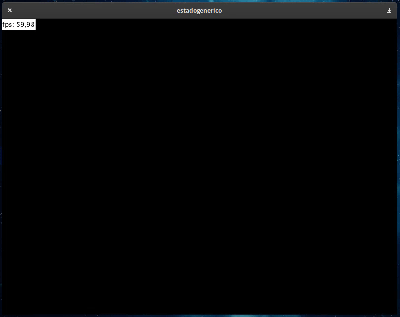

# EstadoAnimado

Cualquier clase que herede de EstadoAnimado puede usar cuatro diferentes animaciones para entrar o salir de escena:

- Lineal
- Cuadrada
- OutBack
- InOutBack

## HolaEstado

Por ejemplo, la clase HolaEstado hereda de EstadoAnimado y hace uso de las animaciones *outBack* y *inOutBack* para entrar y salir de escena:

